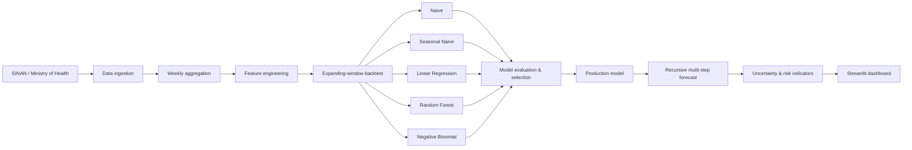

# Dengue Surveillance & Forecasting Dashboard

An end-to-end public-health data product for monitoring and forecasting weekly dengue notifications in Brazil.

**[Launch the live dashboard](https://dengue-surveillance.streamlit.app/)**


## Highlights

- Ingests official Brazilian Ministry of Health SINAN/Dengue data
- Processes large source files in 250,000-row chunks with Parquet caching
- Benchmarks naive, seasonal, linear, tree-based, and count-regression forecasting approaches
- Uses expanding-window backtesting to avoid look-ahead leakage
- Separates model selection from final holdout evaluation
- Produces recursive multi-week forecasts with empirical uncertainty bands
- Includes automated tests and GitHub Actions CI
- Deployed as an interactive Streamlit application

**Current coverage:** Espírito Santo, Rio de Janeiro, Minas Gerais, São Paulo, and Bahia

### Stack

`Python` `pandas` `scikit-learn` `statsmodels` `Plotly` `Streamlit` `PyArrow` `pytest`

---

## Overview

Dengue surveillance data are noisy, seasonal, and subject to reporting delays. A useful forecasting system therefore needs to do more than fit a model to a time series: it needs to ingest changing public-health data, reproduce the information that would have been available at each point in time, compare forecasts against simple baselines, and communicate uncertainty clearly.

This project implements that workflow as a deployed data product.

The dashboard:

- downloads official SINAN/Dengue data from the Brazilian Ministry of Health;
- aggregates individual notifications into a continuous weekly time series;
- generates lag and seasonal features;
- benchmarks statistical, machine-learning, and naive forecasting approaches;
- evaluates models using expanding-window walk-forward backtesting;
- separates model selection from final holdout evaluation;
- produces recursive multi-week forecasts with uncertainty bands;
- classifies short-term trends and historical risk levels; and
- exposes the results through an interactive Streamlit interface.

The current deployment supports:

**Espírito Santo · Rio de Janeiro · Minas Gerais · São Paulo · Bahia**

> **Note:** The modeled signal is weekly dengue notifications, not confirmed dengue cases. Forecasts are analytical estimates and are not official public-health alerts or clinical guidance.

---

## Why I Built This

A standard forecasting notebook can produce an accurate-looking result while accidentally using information from the future.

I wanted to build the project more like a real surveillance system:

1. collect public-health data automatically;
2. construct only features that would have existed at forecast time;
3. compare learned models with strong simple baselines;
4. simulate week-by-week historical deployment;
5. keep the final evaluation period separate from model selection; and
6. turn the analysis into an application that can be used without opening a notebook.

That led to a pipeline that separates data ingestion, modeling, evaluation, forecasting, and presentation rather than keeping the entire project inside a single analysis notebook.

---

## System Architecture



The application is organized into independent modules so the forecasting pipeline can be tested and developed separately from the user interface.

```text
dengue-surveillance-dashboard/
│
├── app.py                  # Streamlit presentation layer
│
├── src/
│   ├── config.py           # URLs, geographic options, model configuration
│   ├── data.py             # SINAN ingestion, aggregation, and caching
│   ├── features.py         # Lag and seasonal feature engineering
│   ├── models.py           # Model fitting and prediction
│   ├── evaluation.py       # Backtesting, metrics, and model selection
│   ├── forecasting.py      # Recursive forecasting and stabilization
│   └── pipeline.py         # End-to-end orchestration
│
├── notebooks/
├── tests/
├── requirements.txt
└── README.md
```

---

## Data Pipeline

The application reads annual SINAN/Dengue datasets published by the Brazilian Ministry of Health.

Because the source files can be large, the ingestion pipeline reads CSV files in **250,000-row chunks** and retains only the columns needed for surveillance.

For each selected state, the pipeline:

1. filters notifications using the state's IBGE code;
2. converts notification dates into Monday-anchored weekly periods;
3. aggregates individual records into weekly notification counts;
4. constructs a continuous weekly date index;
5. explicitly represents missing calendar weeks;
6. stores processed data as Parquet files for faster subsequent startup; and
7. maintains separate cache metadata for each state.

The modeling analysis begins in **January 2023**, while earlier observations can provide historical context for lagged and seasonal signals.

### Data source

Brazilian Ministry of Health, SINAN/Dengue Open Data

https://dadosabertos.saude.gov.br/

---

## Feature Engineering

The forecasting models use information that would be available at prediction time.

### Short-term activity

```text
lag1  → notifications one week earlier
lag4  → notifications four weeks earlier
```

### Seasonality

Epidemiological week is represented cyclically:

\[
\sin(2\pi w/52), \qquad \cos(2\pi w/52)
\]

This avoids treating week 52 and week 1 as if they were far apart numerically.

A **52-week lag** is also constructed as a same-period-last-year seasonal signal. It is used by the seasonal baseline and forecasting logic.

---

## Forecasting Models

The pipeline compares five approaches.

| Model | Role |
|---|---|
| **Naive** | Predicts the previous week's notification count |
| **Seasonal Naive** | Uses the corresponding week from the previous year |
| **Linear Regression** | Interpretable learned baseline using lag and seasonal features |
| **Random Forest** | Nonlinear ensemble model for interactions between recent activity and seasonality |
| **Negative Binomial** | Optional count regression designed for overdispersed count data |

Negative Binomial estimation is treated as optional because optimization can become unstable on some small historical training windows. The pipeline checks convergence and model diagnostics before allowing it into the model bundle.

---

## Evaluation Strategy

### Expanding-window backtesting

Instead of randomly splitting the time series, the project simulates how the model would have behaved in historical deployment.

```text
Train weeks 1–26   → predict week 27
Train weeks 1–27   → predict week 28
Train weeks 1–28   → predict week 29
...
```

Every prediction is therefore generated using **only information available before that week**.

This avoids look-ahead leakage and provides a more realistic estimate of forecasting performance.

### Model selection vs. final evaluation

The pipeline separates:

```text
Historical training
        ↓
Pre-holdout model-selection window
        ↓
Final holdout evaluation
```

The production model is selected before the final holdout is evaluated.

This prevents the final test period from being used directly to choose the model it is supposed to evaluate.

### Evaluation metrics

Forecasts are evaluated using both numerical error and surveillance-oriented behavior:

- **MAE**: Mean Absolute Error
- **RMSE**: Root Mean Squared Error
- **Direction Accuracy**: whether the model correctly predicts the direction of week-over-week change
- **Rising-week Precision**
- **Rising-week Recall**
- **Rising-week F1**
- **False Alarm Rate**

This matters because a surveillance model can have reasonable average error while still performing poorly at identifying rising activity.

---

## Multi-Step Forecasting

Forecasting several weeks ahead introduces an additional problem: predictions become inputs to subsequent predictions.

Each model therefore maintains its own rolling history during recursive forecasting.

```text
Observed data
    ↓
Forecast t+1
    ↓
Use forecast t+1 as history
    ↓
Forecast t+2
    ↓
...
```

For learned models, longer trajectories are stabilized using a combination of:

- recent notification levels;
- same-season historical activity;
- recent trend estimates;
- limits on extreme week-to-week changes; and
- trajectory ceilings.

The goal is to reduce unrealistic runaway forecasts while preserving the short-term signal produced by the model.

---

## Uncertainty

The dashboard reports a forecast range in addition to a point estimate.

Uncertainty is estimated from historical out-of-sample residuals generated during backtesting.

For longer forecast horizons, the interval expands approximately with:

\[
\sqrt{h}
\]

where \(h\) is the forecast step.

These bands are empirical forecasting intervals rather than formal epidemiological confidence intervals.

---

## Dashboard

The Streamlit application contains four main views.

### Overview

Explore:

- weekly notification history;
- rolling averages;
- yearly totals and peaks; and
- seasonal patterns by epidemiological week.

### Models & Evaluation

Compare:

- model-selection results;
- final holdout performance;
- MAE and RMSE;
- direction accuracy;
- rising-week detection; and
- false alarms.

### Backtest

Visualize how each forecasting method performed historically under expanding-window evaluation.

### Monitoring Card

Inspect:

- latest observed activity;
- future forecasts;
- uncertainty bands;
- trend classification;
- historical risk category; and
- public-health context.

---

## Tech Stack

**Language**

- Python

**Data**

- pandas
- NumPy
- PyArrow
- Requests

**Machine Learning & Statistics**

- scikit-learn
- statsmodels

**Visualization & Product**

- Plotly
- Streamlit

**Engineering**

- modular Python package
- chunked data ingestion
- Parquet caching
- expanding-window evaluation
- automated tests
- GitHub Actions CI
- deployed web application

---

## Running Locally

Clone the repository:

```bash
git clone https://github.com/pedrohgp02/dengue-surveillance-dashboard.git
cd dengue-surveillance-dashboard
```

Create a virtual environment:

```bash
python -m venv .venv
```

Activate it.

macOS / Linux:

```bash
source .venv/bin/activate
```

Windows:

```bash
.venv\Scripts\activate
```

Install dependencies:

```bash
pip install -r requirements.txt
```

Run the application:

```bash
streamlit run app.py
```

The first run for a state may take longer because the application downloads and processes the source SINAN datasets. Processed weekly data are cached locally for subsequent runs.

---

## Design Decisions

A few choices were intentional:

**Time-aware validation instead of random train/test splits**  
Forecasting models are evaluated in chronological order to avoid future-data leakage.

**Baselines remain first-class models**  
A learned model is only useful if it can outperform simple strategies such as repeating the previous week or using last year's corresponding week.

**Selection and holdout periods are separated**  
The final evaluation window is not directly used to choose the production model.

**Prediction quality is not reduced to one metric**  
The application evaluates both numerical forecast error and the ability to detect increases in dengue activity.

**The notebook is not the production backend**  
The deployed application uses modular Python code under `src/`; notebooks remain analysis and development artifacts.

---

## Limitations

This project should be interpreted as a forecasting and software-engineering demonstration rather than an epidemiological decision system.

Important limitations include:

- notifications are not equivalent to confirmed cases;
- surveillance data may be revised after initial publication;
- recent weeks can be affected by reporting delays;
- the models use a relatively small feature set;
- uncertainty bands are based on empirical residuals rather than a full probabilistic disease-transmission model;
- forecasts do not currently incorporate weather, mobility, population, vector surveillance, or spatial spillovers between states; and
- historical forecasting performance does not guarantee future performance under distribution shift.

These limitations also provide directions for future development.

---

## Future Work

Potential extensions include:

- expand state coverage across all 27 Brazilian federative units;
- incorporate precipitation, temperature, and humidity data;
- add population-adjusted incidence rates;
- model spatial relationships between neighboring states;
- test gradient-boosted and probabilistic forecasting models;
- improve uncertainty calibration;
- monitor forecast drift over time; and
- expose historical forecast snapshots for reproducibility.

---

## Author

**Pedro Henrique Gonçalves de Paiva**

Computational Sciences · Computer Science & Artificial Intelligence

[Portfolio](https://pedrohgp02.github.io/) · [GitHub](https://github.com/pedrohgp02)

---

## Disclaimer

This dashboard is an independent analytical project using publicly available data.

It is **not** an official product of the Brazilian Ministry of Health and should not be used as a substitute for official epidemiological guidance, diagnosis, or medical advice.
